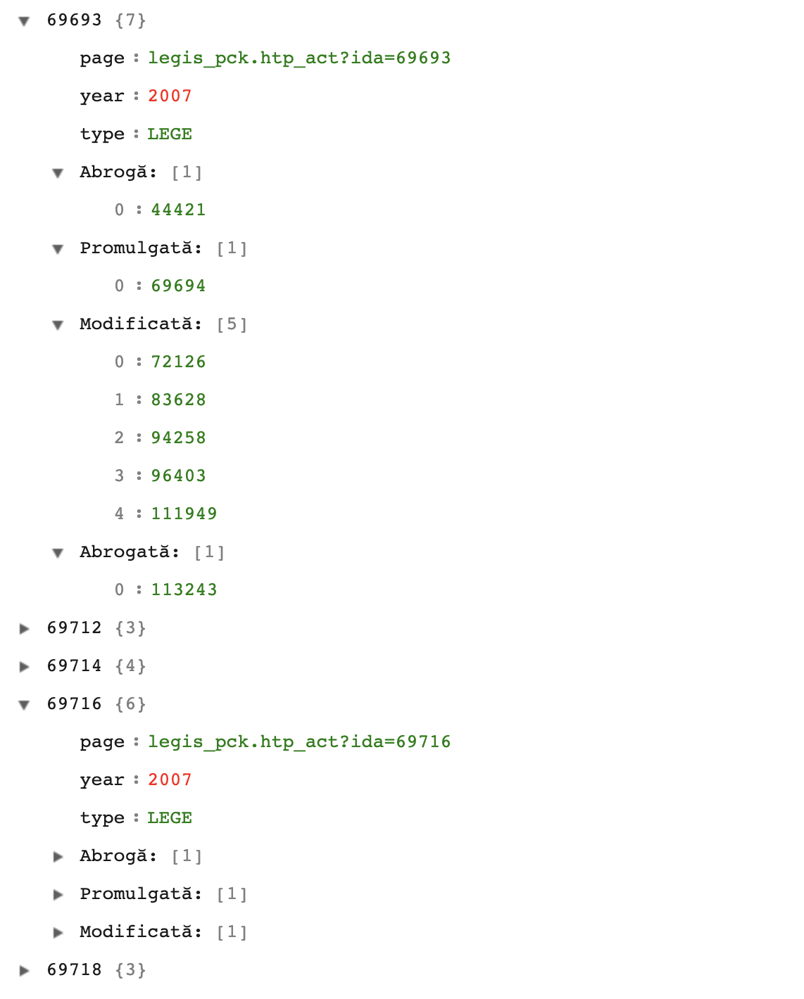

Un script care parsează legile și OUG date din 2007 pana azi și construiește o structură de date.

```
{
    <id_lege>: {
        "page": "legis_pck.htp_act?ida=<id_lege>",
        "year": "anul in care a fost dată",
        "type": "LEGE sau OUG",
        "Modifică": [lista de id-uri de acte pe care le modifică],
        "Modificată": [lista de legi prin care este modificată],
        "Abrogată": [lista de legi care abrogă această lege],
        "Abrogă": [lista de legi pe care le abrogă],
        "Promulgată": [decretul prin care este promulgata],
    }
}
```

Sursa
http://www.cdep.ro/pls/legis/legis_pck.frame



